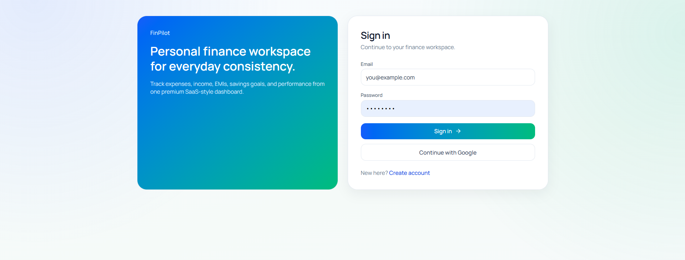
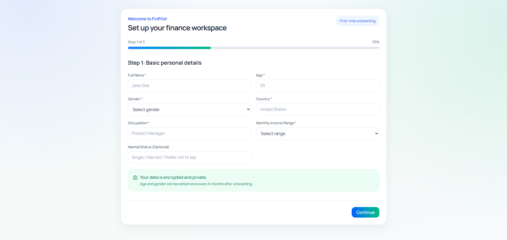
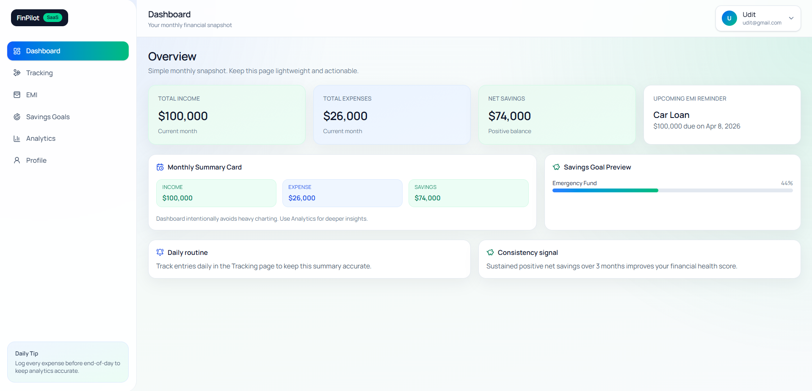

# FinPilot Finance Website

FinPilot is a personal finance web app with onboarding-first authentication, a structured dashboard, and modules for tracking expenses, income, EMIs, and savings goals.

## What’s Inside
- React 19 + Vite
- React Router
- Tailwind CSS
- Firebase Auth + Firestore
- Framer Motion
- Recharts
- Lucide React

## Key Features
- 3-step onboarding flow with profile setup
- Email/password and Google authentication
- Dashboard with income/expense summaries and charts
- Expense, income, EMI, and goal tracking
- Profile and settings management

## Screenshots




## Getting Started

### 1) Install dependencies
```bash
npm install
```

### 2) Configure Firebase
Create a Firebase project, enable Authentication and Firestore, and set the following variables in `.env`:
```bash
VITE_FIREBASE_API_KEY=...
VITE_FIREBASE_AUTH_DOMAIN=...
VITE_FIREBASE_PROJECT_ID=...
VITE_FIREBASE_STORAGE_BUCKET=...
VITE_FIREBASE_MESSAGING_SENDER_ID=...
VITE_FIREBASE_APP_ID=...
```
You can use `.env.example` as a template.

### 3) Run the app
```bash
npm run dev
```

Open the local URL Vite prints in the terminal.

## Firestore Rules (Minimum)
To allow users to access only their own data:
```rules
rules_version = '2';
service cloud.firestore {
  match /databases/{database}/documents {
    match /users/{userId} {
      allow read, write: if request.auth != null && request.auth.uid == userId;
      match /{subcollection}/{docId} {
        allow read, write: if request.auth != null && request.auth.uid == userId;
      }
    }
  }
}
```

## How To Use
1. Sign up or log in.
2. Complete the onboarding steps to set up your profile and preferences.
3. Access the dashboard and start tracking expenses, income, EMIs, and goals.

## Scripts
- `npm run dev` — start dev server
- `npm run build` — production build
- `npm run preview` — preview build
- `npm run lint` — lint codebase

## License
MIT
